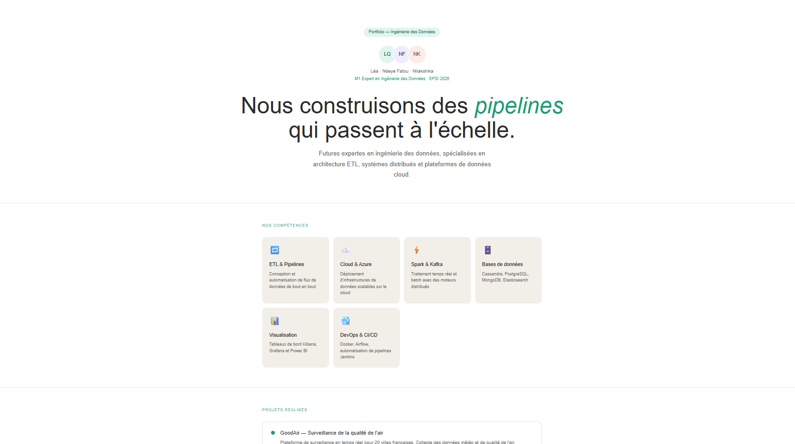
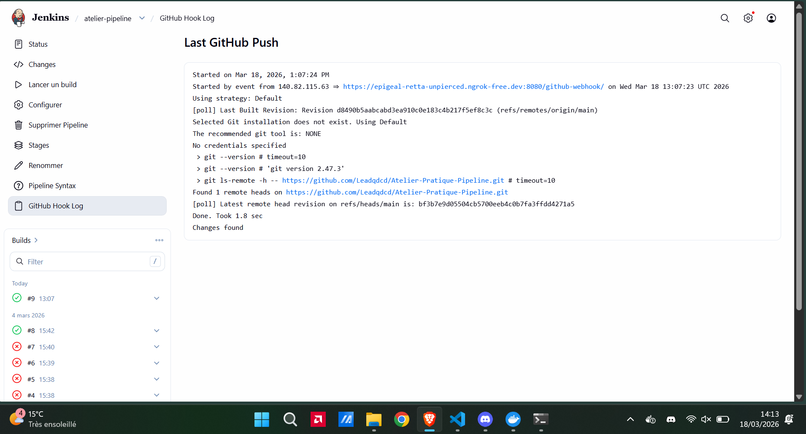
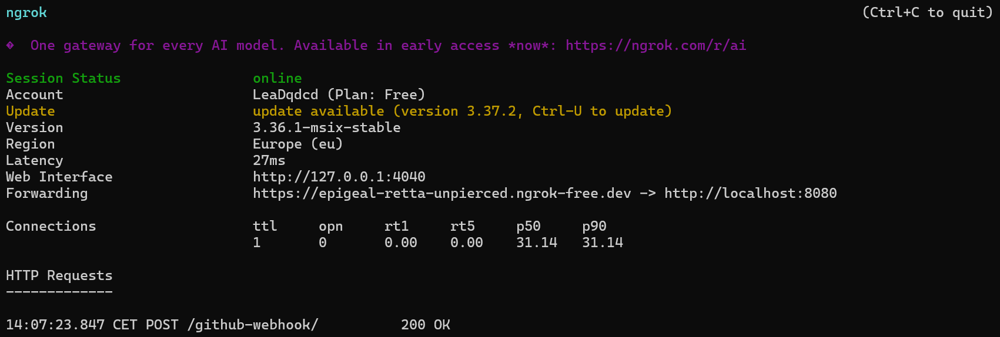
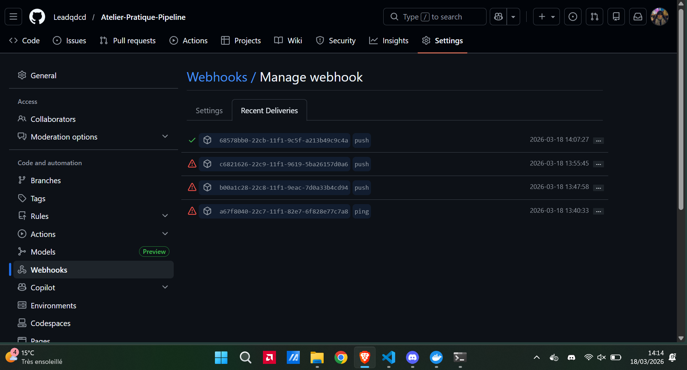

# Atelier Pratique Pipeline — CI/CD avec Next.js, Docker, Jenkins & Heroku

## Présentation

Ce projet a été réalisé dans le cadre de l'atelier **Pipeline as Code** en M1 Expert en Ingénierie des Données à l'EPSI.
Il met en place une chaîne complète de déploiement continu (CI/CD) d'une application Next.js, depuis le code source jusqu'à la mise en production automatique sur Heroku.

**Équipe :** Léa · Ndeye Fatou · Nilakshika

---

## Technologies utilisées

| Technologie | Rôle |
|-------------|------|
| **Next.js** | Framework React pour l'application web |
| **Heroku** | Plateforme cloud pour l'hébergement en production |
| **Docker** | Containerisation de l'application |
| **Jenkins** | Serveur d'automatisation CI/CD |
| **GitHub** | Versioning du code source |
| **GitHub Webhook** | Déclencheur automatique du pipeline à chaque push |
| **ngrok** | Exposition du serveur Jenkins local sur internet |
| **Node.js 20** | Runtime JavaScript pour le build Next.js dans Jenkins |

---

## Architecture du projet
```
Atelier-Pratique-Pipeline/
└── atelier-pratique-pipeline/
    ├── app/
    │   ├── layout.tsx
    │   ├── page.tsx          ← Portfolio affiché en production
    │   └── globals.css
    ├── public/
    ├── Dockerfile            ← Image Docker de l'application
    ├── Jenkinsfile           ← Définition du pipeline CI/CD
    ├── Procfile              ← Commande de démarrage pour Heroku
    ├── package.json
    └── tsconfig.json
```

---

## Étapes réalisées

### 1. Création du projet Next.js
Initialisation d'un projet Next.js avec TypeScript et Tailwind CSS via :
```bash
npx create-next-app@latest
```

### 2. Versioning avec Git & GitHub
- Initialisation du dépôt Git local
- Création du dépôt GitHub `Atelier-Pratique-Pipeline`
- Premier commit et push sur la branche `main`

### 3. Déploiement sur Heroku
- Création d'un compte Heroku et installation du CLI
- Création de l'application `blooming-sands-31054`
- Ajout du `Procfile` pour le démarrage de l'app
- Déplacement de `typescript` dans les `dependencies` pour le build en production
- Déploiement via `git push heroku main`

**Application en ligne :** https://blooming-sands-31054-8ae582b8b0e7.herokuapp.com



### 4. Containerisation avec Docker
Création d'un `Dockerfile` pour builder et exécuter l'application dans un conteneur isolé :
```bash
docker build -t atelier-pratique-pipeline .
docker run -p 3000:3000 atelier-pratique-pipeline
```

### 5. Installation et configuration de Jenkins
Lancement de Jenkins dans un conteneur Docker :
```bash
docker run -d --name jenkins -p 8080:8080 jenkins/jenkins:lts
```
- Récupération du mot de passe initial via `docker exec`
- Installation des plugins suggérés
- Installation du plugin **NodeJS** (version 20.18.0)
- Création du pipeline `atelier-pipeline`



### 6. Création du Jenkinsfile
Définition du pipeline en deux étapes :
```groovy
pipeline {
    agent any
    tools {
        nodejs 'nodejs'
    }
    stages {
        stage('Install') {
            steps {
                dir('atelier-pratique-pipeline') {
                    sh 'npm install'
                }
            }
        }
        stage('Build') {
            steps {
                dir('atelier-pratique-pipeline') {
                    sh 'npm run build'
                }
            }
        }
    }
}
```

### 7. Automatisation via GitHub Webhook
- Installation de **ngrok** pour exposer Jenkins sur internet
- Lancement de ngrok sur le port 8080 :
```bash
ngrok http 8080
```
- Configuration du webhook sur GitHub avec l'URL ngrok : `https://epigeal-retta-unpierced.ngrok-free.dev/github-webhook/`
- Activation de **"GitHub hook trigger for GITScm polling"** dans Jenkins
- Activation de la **compatibilité proxy CSRF** dans Jenkins

Désormais, chaque `git push origin main` déclenche automatiquement le pipeline Jenkins.




---

## Flux du pipeline automatisé
```
git push origin main
        ↓
GitHub détecte le push
        ↓
GitHub envoie une notification au Webhook
        ↓
Jenkins reçoit la notification via ngrok
        ↓
Jenkins exécute le Jenkinsfile
        ↓
Stage Install : npm install
        ↓
Stage Build : npm run build
        ↓
Pipeline réussi ✅
```

---

## Lancer le projet en local

### Avec Node.js
```bash
npm install
npm run dev
```
Ouvrir http://localhost:3000

### Avec Docker
```bash
docker build -t atelier-pratique-pipeline .
docker run -p 3000:3000 atelier-pratique-pipeline
```

### Relancer Jenkins
```bash
docker start jenkins
ngrok http 8080
```

---

## Bilan

Ce projet nous a permis de mettre en place une chaîne CI/CD complète et fonctionnelle :

- Versionner notre code avec Git et GitHub
- Déployer une application web sur Heroku
- Containeriser une application avec Docker
- Automatiser les builds avec Jenkins
- Déclencher le pipeline automatiquement via un webhook GitHub

**M1 Expert en Ingénierie des Données · EPSI · 2026**